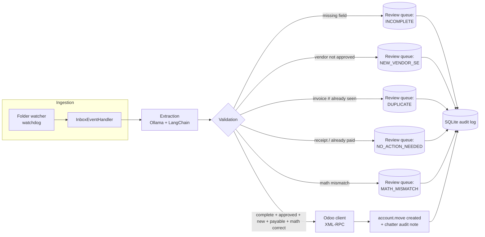

# Automated Odoo Invoicing Workflow Agent — Design Doc

**Exercise:** Huma — Human Agent take-home · **Author:** Mann · **Clock:** ~7h to call

This doc is both the design walkthrough for the call and the working plan I built against.
It's deliberately scoped to what a half-day, well-reasoned slice can credibly deliver.

## 1. Problem framing & scope

The brief's four stages (monitor → identify → parse → push to Odoo) are the skeleton.
The actual hard problems live in the **validation layer** and in **deciding when not to act** —
that's where I spent the design effort, because that's what the rubric ("human-in-the-loop
judgement", "validation & compliance") is really scoring.

**What v0.5 (this submission) actually does, end to end, for real:**

| Stage | Real or mocked? |
|---|---|
| Inbox monitoring | **Mocked** — a continuously watched folder (`data/inbox/`) powered by `watchdog` stands in for the Gmail inbox. |
| PDF identification | Real — any `.pdf` dropped in the folder is picked up immediately. |
| Extraction | **Real** — local LLM (Ollama, your `gemma3:4b` / `qwen3:4b`) via LangChain `ChatOllama`. The structured schema uses `dataclasses` with lenient parsers. |
| Validation | Real — completeness, approved-supplier, duplicate, already-paid/receipt checks, AND a math validation check. |
| Odoo push | **Real** — a self-hosted Odoo Community instance (Podman), real `account.move` records created over XML-RPC, real chatter audit notes. |
| Audit log | Real — local SQLite ledger + Odoo chatter. |

## 2. Assumptions

1. **Odoo version:** Odoo 17 Community, self-hosted via Podman. No paid Accounting modules.
2. **Auth to Odoo:** username + password over XML-RPC.
3. **Partner resolution:** if the extracted vendor name doesn't yet exist as an Odoo `res.partner`, the agent creates it (find-or-create).
4. **"Posted" vs "draft":** v0.5 calls `action_post` (not just create-as-draft). Configurable (`auto_post: true|false`).
5. **Document type matters, not just "has a total on it":** one sample is a *receipt* for an already-collected card payment. I added a check to ignore these.
6. **Date/amount parsing:** invoices use mixed date formats and currencies. Extracted strings are kept raw, and float/amount normalization happens downstream safely.
7. **Vendor name matching is normalized, not exact-string.**

## 3. Architecture



Component layout:

```
app/
  watchers/inbox_watcher.py   continuous event-driven orchestrator
  integration/llm/            base.py · ollama_extractor.py
  integration/odoo/           base.py · odoo_xmlrpc_client.py
  schemas/                    ExtractedInvoice (dataclass), LineItem, ReviewFlag
  repositories/               supplier_repo · invoice_repo · review_repo
  services/                   extraction_service · validation_service · math_validation · odoo_service
  observability/audit_log.py  structured event log
  core/config.py              loads config/*.yaml + .env via pydantic-settings
  web/dashboard.py            interactive UI for human review
```

## 4. Data extracted (schema)

We use standard `dataclasses` with lenient parsing to avoid strict Pydantic validation errors from local models.

```python
@dataclass
class LineItem:
    description: str | None = None
    quantity: float | None = None
    unit_price: float | None = None
    amount: float | None = None

@dataclass
class ExtractedInvoice:
    vendor_name: str | None = None
    invoice_number: str | None = None
    invoice_date: str | None = None
    due_date: str | None = None
    total_amount: float | None = None
    currency: str | None = None
    payment_terms: str | None = None
    tax_type: str | None = None
    tax_amount: float | None = None
    line_items: list[LineItem] = field(default_factory=list)
    document_type: str = "unknown"
    extraction_confidence: float | None = None
```

## 5. Pipeline stages

### 5.1 Ingestion (event-driven)
The agent runs continuously using `watchdog` on `data/inbox/`. `InboxEventHandler` intercepts files the moment they are dropped or moved.

### 5.2 PDF identification
Trivial in the mock (anything with a `.pdf` suffix).

### 5.3 Extraction
`pdfplumber` pulls raw text. The raw text + target schema go to `ChatOllama` with a JSON-mode prompt. A robust coercion mechanism cleans up symbols (e.g. `$`, `,`).

### 5.4 Validation & compliance
Checks:

1. **Completeness**: Evaluated against `config/required_fields.yaml` -> `INCOMPLETE`.
2. **Approved supplier**: Evaluated against xlsx + overrides using rapidfuzz -> `NEW_VENDOR_SE`.
3. **Duplicate**: Evaluated against SQLite `(normalized_vendor, invoice_number)` -> `DUPLICATE`.
4. **Already-paid**: Based on keywords and `document_type` -> `NO_ACTION_NEEDED`.
5. **Math Validation**: Checks if line items sum up perfectly to the expected total. Emits `MATH_MISMATCH` if there's an error.

### 5.5 Decision & action
All-pass → build Odoo payload, post chatter. Any failure → write a `ReviewFlag` row to `data/agent.db`.

### 5.6 Re-processing after SE approval
Using the web dashboard (`scripts/run_dashboard.py`), users can approve a vendor with one click. The dashboard dynamically updates `config/approved_suppliers_overrides.yaml` and revalidates queued items instantly.
